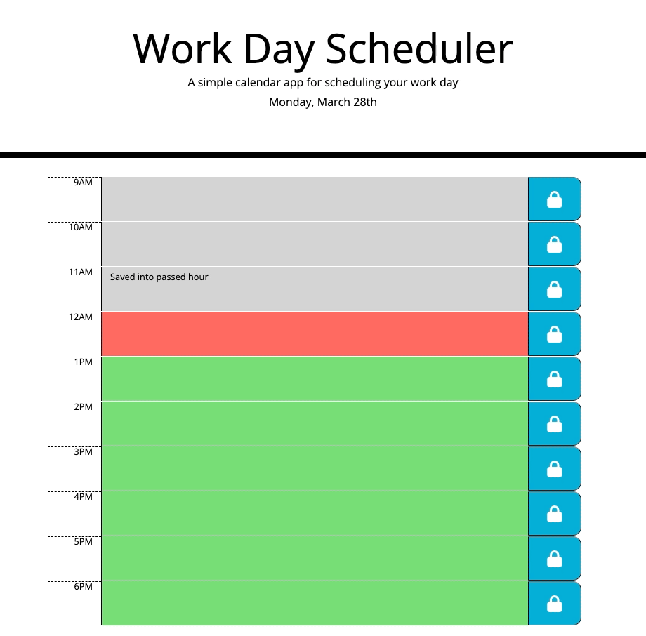

# Fernando Almeida - Work Day Scheduler.

## Purpose
A website that provides a quick way to keep your day organized by allowing the user saving their tasks into a calendar planner. 

## Built With
* HTML
* JS
* CSS

## Website
https://flalmeida3105.github.io/work-day-scheduler/

## About the Website
Never forget any important meeting or task that needs to be completed in your daily life. With Work Day Scheduler, you'll have the freedom to define what to do at the time that suits you best.

Just click on the desired time, enter a description and click on the padlock to save your schedule.

The calendar is fully dynamic and color-based to make it easier to understand when an hour has passed, as the field will be gray, if it is the current time, the field will be red and if it is a future date, the field will be displayed in green.

For more details, see the GIF below.

## Enjoy a quick overview of the website

## Contribution
Powered by Fernando Almeida